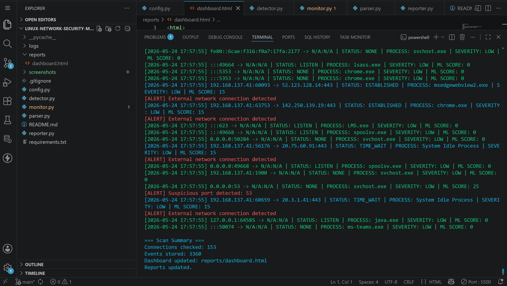

# Linux Network Security Monitor V14

A real-time cybersecurity monitoring and threat detection system built with Python.

This project monitors active network connections, detects suspicious behavior, generates alerts, logs security events, and creates a live HTML dashboard for SOC-style monitoring and analysis.

---

## Features

- Real-time network connection monitoring
- Suspicious external IP detection
- Suspicious port detection
- Process monitoring
- Machine Learning threat scoring simulation
- Live security event logging
- Auto-generated HTML dashboard
- JSON and TXT reporting
- Geo-IP simulation
- Severity classification system
- SOC-style terminal alerts
- Auto-refresh dashboard analytics

---

## Technologies Used

- Python 3
- psutil
- HTML/CSS
- JSON
- Cybersecurity event analysis
- Network socket inspection

---

## Project Structure

```bash
linux-network-security-monitor/
│
├── logs/
│   └── network_logs.txt
│
├── reports/
│   └── dashboard.html
│
├── screenshots/
│   ├── dashboard_v14.png
│   └── live_terminal_monitoring.png
│
├── config.py
├── detector.py
├── monitor.py
├── parser.py
├── reporter.py
├── requirements.txt
├── README.md
└── .gitignore
---

# Screenshots

## Dashboard


## Live Monitoring

